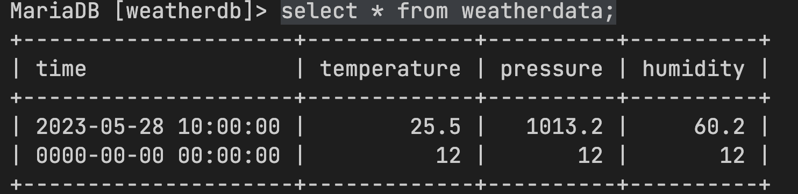

To insert using http post request:

1.start apache web server through XAMPP(the php file should be in htdocs folder of XAMPP, also the php fille should post to mysql database on `<server>`:`<portnumber>`)

2.start mysql server using XAMPP on `<portnumber>`

3. For testing : Send GET request either using postman or putting following command in browser : http://localhost/insertweatherdata.php?time=0000-00-00%20000:00:00&pressure=12.12&temperature=12.12&humidity=12.12
4. To check whether its actually inserted, log into mysql :

   /Applications/XAMPP/xamppfiles/bin/mysql -u root

   select weatherdb; select * from weatherdata;
5. To upload using esp8266 or someother board, you need to send a http post request from microcontroller code
